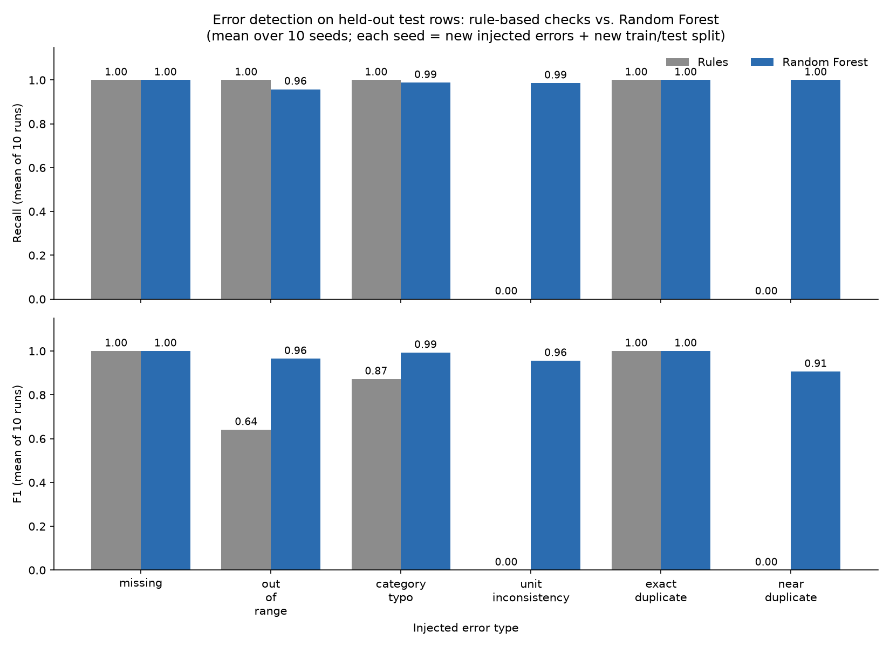

# heart-data-quality

**ML-based data-quality detection vs. rule-based checks on clinical data (UCI Heart Disease, Cleveland).**

- **Problem:** Dirty clinical data (blanks, impossible values, typos, wrong units, duplicate patients) silently corrupts downstream ML, and hand-written cleaning rules only catch the errors someone thought of in advance.
- **Method:** Inject 6 labelled error types into the clean Cleveland table (297 patients), then compare DWM-style rules, a supervised cell-level Random Forest error classifier, and an unsupervised Isolation Forest on the same held-out records (split by `record_id`, repeated over 10 seeds).
- **Result:** Rules are already perfect on missing values and exact duplicates (F1 1.00) but score F1 0.00 on unit errors and near-duplicates. The Random Forest reaches mean F1 0.96 (unit errors) and 0.91 (near-duplicates) over 10 runs. The label-free Isolation Forest flags only 22% of dirty rows at a 10% review budget (mean ROC-AUC 0.76).
- **Limitation:** The errors are synthetic and the Random Forest is trained on the same error generator it is tested on, so its scores are optimistic. The dataset is also small (1–7 test errors per type per split).
- **Next step:** Extend near-duplicate detection into entity resolution and plug the ML quality scorer into a Data Washing Machine-style pipeline. Test on real clinical data such as MIMIC.

---

## How to run

Requires Python 3.10+ (developed on 3.13).

```bash
python -m venv venv
```

```bash
venv\Scripts\activate
```
(on macOS/Linux: `source venv/bin/activate`)

```bash
pip install -r requirements.txt
```

Run the whole experiment from the command line (prints the tables and writes `data/` and `results/`):

```bash
python -m src.evaluate
```

Or run the story-style notebook end-to-end:

```bash
python -m nbconvert --to notebook --execute --inplace notebooks/data_quality_demo.ipynb
```

> Use `python -m nbconvert` from the activated venv. On some machines a bare `jupyter nbconvert` picks up a *system* Jupyter install and its kernel, which runs different library versions and gives slightly different numbers.

Everything uses one seed (42), and the core libraries are pinned in `requirements.txt`, so the numbers below reproduce exactly. The raw data is downloaded once through `ucimlrepo` (with a direct-download fallback) and cached in `data/heart_raw.csv`.

## Project structure

```
heart-data-quality/
  README.md              <- you are here
  EXPLAINER.md           <- plain-English walkthrough + likely questions
  requirements.txt
  data/
    heart_raw.csv            original 303 rows (cached download)
    heart_clean.csv          297 complete rows, readable categories, record_id
    heart_corrupted.csv      327 rows after error injection (shuffled)
    ground_truth_cells.csv   per-cell label: "" or the injected error type
  src/
    load_data.py         download + clean + readable categories
    inject_errors.py     6 error types, cell- and row-level ground truth
    rules.py             null / range / allowed-category / exact-duplicate rules
    ml_detectors.py      Isolation Forest (rows) + Random Forest (cells) + features
    evaluate.py          scoring, 10-seed robustness check, chart
  notebooks/
    data_quality_demo.ipynb
  results/
    results_table.csv        main run (seed 42), held-out test rows
    results_repeated.csv     mean over seeds 42-51
    detection_comparison.png
```

## Results



### How to read the numbers
- **Cell errors** (missing, out_of_range, category_typo, unit_inconsistency) are scored per cell. **Duplicates** are scored per row.
- **precision / recall / F1** count a hit only if the detector found the error *and* named the right type.
- **recall_any** counts a hit if the detector flagged the error with *any* label. For example, a unit error flagged by a range rule as `out_of_range` counts here.
- All scores are on **held-out test rows only** (30% of records, split by `record_id`).

### Main run: seed 42 (`results/results_table.csv`)
Test set: 99 of 327 rows, 24 of them dirty. Supports are tiny (1–7 per type), so read this together with the 10-seed table below.

| error type | level | support | Rules P | Rules R | Rules F1 | Rules recall_any | RF P | RF R | RF F1 |
|---|---|---|---|---|---|---|---|---|---|
| missing | cell | 7 | 1.00 | 1.00 | 1.00 | 1.00 | 1.00 | 1.00 | 1.00 |
| out_of_range | cell | 4 | 0.50 | 1.00 | 0.67 | 1.00 | 1.00 | 1.00 | 1.00 |
| category_typo | cell | 1 | 1.00 | 1.00 | 1.00 | 1.00 | 1.00 | 1.00 | 1.00 |
| unit_inconsistency | cell | 4 | 0.00 | 0.00 | 0.00 | 1.00 | 1.00 | 1.00 | 1.00 |
| exact_duplicate | row | 4 | 1.00 | 1.00 | 1.00 | 1.00 | 1.00 | 1.00 | 1.00 |
| near_duplicate | row | 4 | 0.00 | 0.00 | 0.00 | 0.00 | 1.00 | 1.00 | 1.00 |

Row level ("is this record dirty at all?", 24 dirty test rows):

| method | precision | recall | F1 | ROC-AUC |
|---|---|---|---|---|
| Rules | 1.00 | 0.83 | 0.91 | – |
| Random Forest | 1.00 | 1.00 | 1.00 | – |
| Isolation Forest (top 10% flagged) | 0.78 | 0.29 | 0.42 | 0.79 |

### Robustness: mean over 10 seeds (`results/results_repeated.csv`)
Each seed injects new errors *and* draws a new train/test split. Support is the total across the 10 test sets.

| error type | support | Rules P | Rules R | Rules F1 | Rules recall_any | RF P | RF R | RF F1 (± std) |
|---|---|---|---|---|---|---|---|---|
| missing | 43 | 1.00 | 1.00 | 1.00 | 1.00 | 1.00 | 1.00 | 1.00 (± 0.00) |
| out_of_range | 40 | 0.49 | 1.00 | 0.64 | 1.00 | 0.98 | 0.96 | 0.97 (± 0.06) |
| category_typo | 43 | 0.79 | 1.00 | 0.87 | 1.00 | 1.00 | 0.99 | 0.99 (± 0.02) |
| unit_inconsistency | 42 | 0.00 | 0.00 | 0.00 | 1.00 | 0.94 | 0.99 | 0.96 (± 0.08) |
| exact_duplicate | 43 | 1.00 | 1.00 | 1.00 | 1.00 | 1.00 | 1.00 | 1.00 (± 0.00) |
| near_duplicate | 37 | 0.00 | 0.00 | 0.00 | 0.37 | 0.85 | 1.00 | 0.91 (± 0.12) |

| row level (236 dirty test rows in total) | precision | recall | F1 | ROC-AUC |
|---|---|---|---|---|
| Rules | 1.00 | 0.90 | 0.95 | – |
| Random Forest | 0.98 | 1.00 | 0.99 | – |
| Isolation Forest (top 10% flagged) | 0.60 | 0.22 | 0.32 | 0.76 |

Isolation Forest, share of dirty rows flagged by error type (10-seed mean): missing 0.52, category_typo 0.38, out_of_range 0.26, unit_inconsistency 0.24, near_duplicate 0.15, exact_duplicate 0.00.

### What this shows
1. **Rules win where the error is well-defined.** Blanks and byte-identical duplicates are solved problems (F1 1.00). ML adds nothing there.
2. **Rules detect unit errors but mislabel them.** Every unit error lands outside a plausible range, so the rules *flag* it (recall_any 1.00) but call it `out_of_range`. The same confusion drags rule precision for `out_of_range` down to 0.49. The Random Forest separates the two (unit-error F1 0.96) using the ratio to the column median. This matters because the right fix differs: convert the unit instead of deleting the value.
3. **Near-duplicates are the rules' blind spot.** Rules find 0% of them. A typo'd near-duplicate is at best flagged as a `category_typo` in one cell (recall_any 0.37). A "distance to the most similar earlier record" feature, a tiny entity-resolution step, is the Random Forest's most important feature and lets it find all of them, at the cost of some false alarms (precision 0.85).
4. **Without labels it is much harder.** Isolation Forest ranks dirty rows above clean ones better than chance, but at a 10% review budget it finds about a fifth of the dirty rows and never flags an exact duplicate, because a duplicate looks perfectly normal.

## Honest limitations
- **Synthetic errors.** They are injected by a simple generator. Real errors are messier, correlated (one miscalibrated device, one clinic's form), and sometimes plausible-looking.
- **Small dataset.** 297 patients and about 15 errors per type, so a single test split holds only 1–7 errors per type. The 10-seed average is the more trustworthy number.
- **Supervised advantage.** The Random Forest learns from injected labels produced by the same generator it is tested on. In practice such labels are expensive or unavailable. Isolation Forest needs no labels, and closing that gap is the real research question.
- **Hand-chosen knowledge.** The plausible ranges were chosen by hand, and the Random Forest reuses them as a feature (`dist_outside_range`), so it partly builds on the rules rather than replacing them.
- **Isolation Forest threshold.** Flagging the top 10% is a review-budget assumption. The threshold-free ROC-AUC is reported alongside it.
- **Duplicate direction.** The "earlier record" features assume `record_id` reflects entry order, so the later-entered copy is the duplicate.
